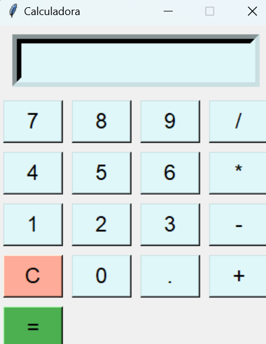

# Calculadora en Python con Tkinter

Este proyecto es una calculadora simple implementada en Python usando programación orientada a objetos (POO) y la biblioteca Tkinter para la interfaz gráfica de usuario (GUI). La calculadora puede realizar operaciones básicas como suma, resta, multiplicación y división,.

## Características

- Interfaz gráfica de usuario construida con Tkinter.
- Operaciones aritméticas básicas: suma, resta, multiplicación y división.
- Manejo de errores para la división por cero.
- Soporte para entrada de teclado para mayor comodidad.

## Captura de Pantalla 


## Instalación

1. **Clonar el repositorio**:
    ```bash
    git clone https://github.com/Vikolow/Aprendiendo_Python.git
    ```

2. **Navegar al directorio del proyecto**:
    ```bash
    cd Aprendiendo_Python/POO/Proyectos/Calculadora
    ```

3. **Instalar las dependencias**:
    No se requieren dependencias adicionales más allá de Python 3.x y Tkinter, que generalmente viene incluido con Python.

## Ejecución

Para ejecutar la calculadora, simplemente corre el archivo `calculadora_tk.py`:

```bash
python calculadora_tk.py
```

## Uso

La calculadora puede ser usada tanto con el ratón como con el teclado. Los botones representan los dígitos y las operaciones aritméticas. La tecla Enter realiza la operación y la tecla Backspace limpia el display.
